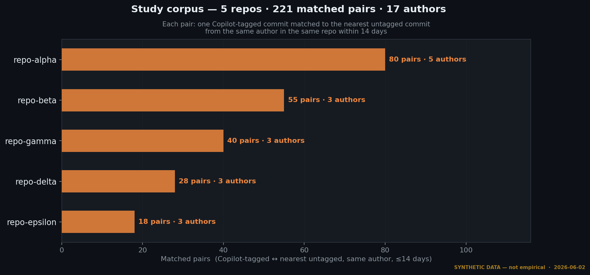
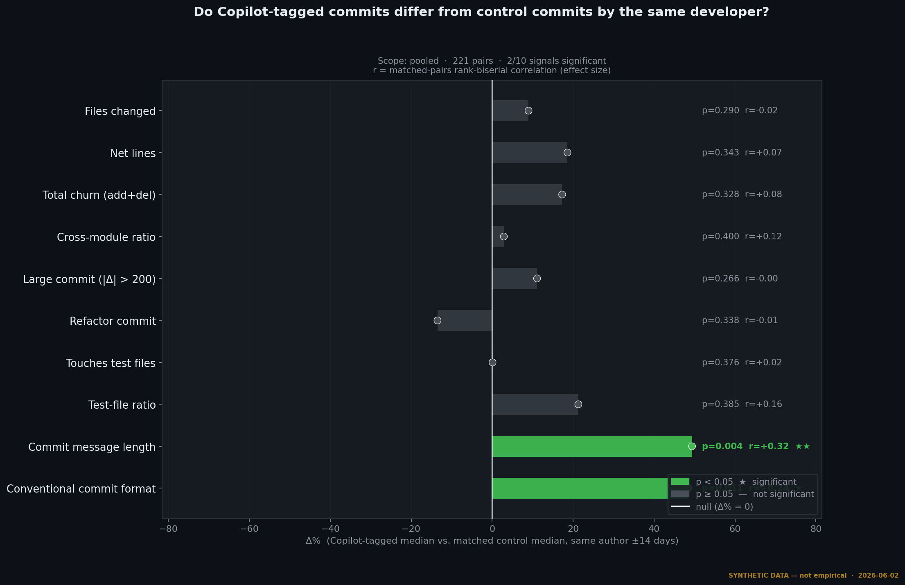
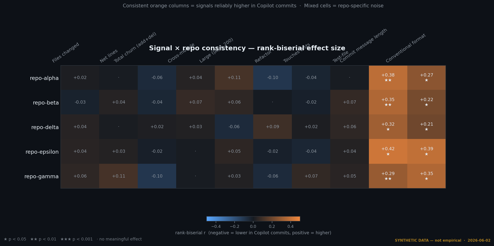
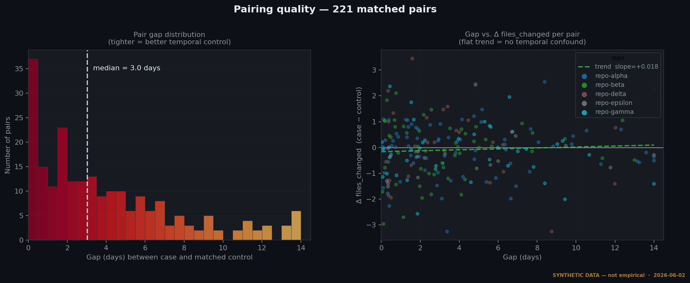

# copilot-signal

> **Do Copilot-tagged commits differ measurably from control commits by the same developer?**

[](https://www.python.org/)
[](LICENSE)

---

## Why This Study Exists

[dev-fingerprint](https://github.com/riadmaouchi/dev-fingerprint) showed that AI adoption leaves no detectable trace in a developer's longitudinal commit history. Simon Willison — documented daily Claude user — shows Fisher p = 0.75. The developers who drifted most in that corpus had non-AI explanations: career changes, role transitions.

The problem with the longitudinal design is confounding. When you compare 2019 commits to 2024 commits, you conflate AI adoption with everything else that changed: project maturity, team size, developer seniority, framework evolution.

This study attacks the same question with a fundamentally different design.

---

## The Ground Truth That Already Exists

GitHub Copilot adds a verifiable trailer to commit messages when its commit-generation feature is used:

```
Co-Authored-By: GitHub Copilot <copilot@github.com>
```

This is commit-level ground truth. For developers who enable this feature, we know — for individual commits — whether Copilot was involved. We use it to build **matched pairs**: for each tagged commit, we find the nearest untagged commit from the **same author, same repo, within 14 days**.

Within-author, within-repo, ±14-day pairing controls for developer style, project conventions, project phase, and team culture. What remains is the isolated effect of AI assistance — if any exists.

---



*Figures show synthetic data. Run `python run_study.py --discover` with a GitHub token to generate real results.*

---

## Main Finding (Synthetic Demonstration)



*Forest plot: Δ% between Copilot-tagged commits and matched controls. Vertical zero line = null hypothesis. Green bars = p < 0.05.*

The synthetic corpus is designed around two plausible priors:
- **Commit message signals** (length, conventional format) are plausibly higher in Copilot commits — Copilot's "generate commit message" feature produces verbose, structured summaries.
- **File-level signals** (files changed, net lines, cross-module ratio) show no consistent difference — those are driven by the task, not the tool.

Whether this prior holds on real data is exactly what the study tests.

---

## Signal × Repo Consistency



*Rank-biserial effect size r per signal per repo. Orange = higher in Copilot commits. Stars = p < 0.05.*

Consistent orange columns across repos would indicate a real effect. Mixed cells indicate repo-specific noise or selection bias. A blank matrix would confirm the dev-fingerprint null result at commit resolution.

---

## Pairing Quality



*Left: distribution of gap_days between case and control. Right: gap vs. Δfiles_changed — should be flat if pairing removes temporal confound.*

---

## Study Design

```
GitHub commit search
      │  "co-authored-by:copilot@github.com"
      ▼
Repo corpus  (configured in configs/study.yaml)
      │
      ▼
Per-repo: fetch all commits  (Copilot-tagged + untagged)
      │
      ▼
CommitSignals extraction  (Level-A process signals)
      │  files_changed · net_lines · total_churn
      │  cross_module_ratio · is_refactor · touches_tests
      │  message_length · has_conventional_commit
      │
      ▼
Pair matching  (author, repo, ≤14 days, one-to-one)
      │
      ▼
Wilcoxon signed-rank test  (paired, non-parametric)
      │  per signal, per repo, and pooled
      │  effect size: matched-pairs rank-biserial r
      │
      ▼
StudyResult  —  probabilistic interpretation
```

**Why Wilcoxon?** Commit signals are heavy-tailed and non-normal. Wilcoxon makes no distributional assumption and is robust to outliers — appropriate for small-to-moderate sample sizes.

---

## What This Can and Cannot Claim

| Can claim | Cannot claim |
|-----------|-------------|
| Whether tagged and untagged commits by the same developer differ on specific metrics | That the tag means Copilot wrote all the code |
| Effect size and direction for each signal | Generalization to developers who don't enable the tag |
| Whether findings are consistent across repos | Causation (the tag correlates with commit type, not just AI use) |

**Key selection bias**: the Copilot co-authorship tag is opt-in. Developers who enable it are self-selected. The comparison is valid within each author (their tagged vs. untagged commits) but cannot generalize to all AI-assisted development.

---

## Reproduce

```bash
git clone https://github.com/riadmaouchi/copilot-signal
cd copilot-signal
pip install -e ".[dev]"

# Generate figures from synthetic data (no token needed)
python generate_figures.py --synthetic

# Discover repos with Copilot-tagged commits, then analyze them
export GITHUB_TOKEN=ghp_...
python run_study.py --discover --top 20

# Or analyze specific repos from configs/study.yaml
python run_study.py --repos microsoft/vscode,denoland/deno --max-gap 14

# Regenerate figures from real results
python generate_figures.py
```

---

## Project Structure

```
copilot-signal/
├── src/copilotsig/
│   ├── collector/
│   │   ├── github.py      GitHub client · commit search · Copilot tag detection
│   │   └── cache.py       Disk cache (SQLite, TTL 7 days)
│   ├── analyzer/
│   │   ├── signals.py     Per-commit Level-A signal extraction
│   │   ├── pairing.py     Case-control matching (author, repo, ±N days)
│   │   └── stats.py       Wilcoxon signed-rank + rank-biserial effect size
│   ├── synthetic.py       Synthetic data generator (demo + testing)
│   └── models.py          Commit · CommitPair · SignalComparison · StudyResult
├── configs/study.yaml     Curated repo list (tiered by expected tag volume)
├── docs/img/              4 figures
├── reports/               Per-repo JSON results (auditable)
├── run_study.py           Entry point: --discover or --repos
└── generate_figures.py    Figure generation (--synthetic for demo)
```

---

## Relationship to dev-fingerprint

| Dimension | dev-fingerprint | copilot-signal |
|-----------|----------------|----------------|
| Design | Longitudinal (within-developer, over time) | Cross-sectional (case-control, within-author) |
| Ground truth | Developer-level declaration | Commit-level tag |
| Confound control | None (time conflates everything) | Paired design (author, repo, ±14 days) |
| Sample size | 11 developers, 6,670 commits | Potentially thousands of pairs |
| Primary claim | Process drift vs. historical baseline | Tagged vs. untagged commit structure |
| Known limitation | Confounds AI with role/phase changes | Tag is opt-in, selection bias |

---

MIT License
